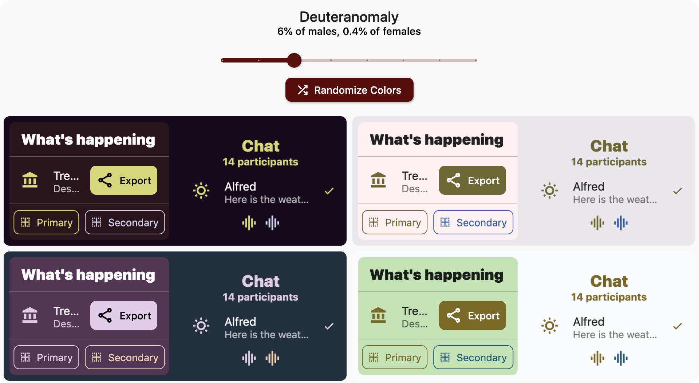

# Color Blindness on Flutter

Every app has colors. How to make sure they are accessible?
How to avoid accessibility issues as other people in the same project start to change the Color Scheme?
This is a Flutter plugin that can:

1. Change the whole theme, by wrapping a ColorScheme with `colorBlindnessColorScheme()`.
2. Be used in CI tests, with `colorBlindnessAssertContrast()`.
3. Be used to modify a single color.

The main idea is for you to (temporarily) wrap your `ColorScheme()` into a `colorBlindnessColorScheme()` with a `ColorBlindnessType` as the secondary parameter.
Doing so, it will emulate color blindness by modifying **ALL** ColorScheme colors.
Then, you may change the type parameter and hot refresh/restart the app to see how it looks under different eyes.

The interactive sample allows you to see how it works:

<a href="https://bernaferrari.github.io/ColorBlindnessFlutter/"></a>

[](https://bernaferrari.github.io/ColorBlindnessFlutter/)

## Usage

In the `pubspec.yaml` of your flutter project, add the following dependency:

[](https://pub.dev/packages/color_blindness_color_scheme)

```yaml
dependencies:
  color_blindness: ^VERSION
```
### Color Scheme

In your project, just wrap the `ColorScheme.dark(...)` with `colorBlindnessColorScheme()`.

```dart
import 'package:random_colorscheme/color_blindness_color_scheme.dart';

Theme(
  data: ThemeData(
    colorScheme: colorBlindnessColorScheme(ColorScheme.dark(), ColorBlindnessType.tritanopia),
  ),
  child: MyApp(),
)
```
### CI
You can add a test to make sure the ColorScheme is always accessible.
The second parameter is the WCAG minimum threshold, which is usually at least 4.5.

```dart
colorScheme = ColorScheme.light(
  primary: const Color(0xff9f0042),
  secondary: const Color(0xff1e6100),
);
expect(() => colorBlindnessAssertContrast(colorScheme, 4.0), returnsNormally);
```

### Single Color
You can either use `colorBlindness()` with `ColorBlindnessType` as the secondary parameter, or call the methods individually. 

```dart
const primary = const Color(0xff9f0042);
// indirect way
colorBlindness(primary, ColorBlindnessType.tritanopia);

// direct way
tritanopia(primary);
```

## Reasoning
This started in my [Color Studio project](https://github.com/bernaferrari/color-studio). There, you can preview different color blindness in different themes.
However, I saw the possibility of contribution for those already using ColorScheme in an existing app.
Similar to [RandomColorScheme](https://github.com/bernaferrari/RandomColorScheme), this may reach deeper places than Color Studio ever will.
Also, there were ZERO packages in pub.dev related to color blindness, so this was the first one.
The color blindness calculation was retrieved from [ColorBlinds](https://github.com/jordidekock/Colorblinds) project.

## Function listing
- `colorBlindnessColorScheme(scheme: ColorScheme, type: ColorBlindnessType): ColorScheme`
- `colorBlindnessAssertContrast(scheme: ColorScheme, minThreshold: double = 4.5)`
- `colorBlindness(color: Color, type: ColorBlindnessType): Color`
- `protanomaly(color: Color): Color`
- `deuteranomaly(color: Color): Color`
- `tritanomaly(color: Color): Color`
- `protanopia(color: Color): Color`
- `deuteranopia(color: Color): Color`
- `tritanopia(color: Color): Color`
- `achromatopsia(color: Color): Color`
- `achromatomaly(color: Color): Color`
    
`enum ColorBlindnessType { none, protanomaly, deuteranomaly, tritanomaly, protanopia, deuteranopia, tritanopia, achromatopsia, achromatomaly }`
## Reporting Issues

If you have any suggestions or feedback, issues and pull requests are welcome.
You can report [here](https://github.com/bernaferrari/ColorBlindnessFlutter/issues).

## License

    Copyright 2020 Bernardo Ferrari

    Permission is hereby granted, free of charge, to any person obtaining a copy of this software and associated documentation files (the "Software"), to deal in the Software without restriction, including without limitation the rights to use, copy, modify, merge, publish, distribute, sublicense, and/or sell copies of the Software, and to permit persons to whom the Software is furnished to do so, subject to the following conditions:

    The above copyright notice and this permission notice shall be included in all copies or substantial portions of the Software.

    THE SOFTWARE IS PROVIDED "AS IS", WITHOUT WARRANTY OF ANY KIND, EXPRESS OR IMPLIED, INCLUDING BUT NOT LIMITED TO THE WARRANTIES OF MERCHANTABILITY, FITNESS FOR A PARTICULAR PURPOSE AND NONINFRINGEMENT. IN NO EVENT SHALL THE AUTHORS OR COPYRIGHT HOLDERS BE LIABLE FOR ANY CLAIM, DAMAGES OR OTHER LIABILITY, WHETHER IN AN ACTION OF CONTRACT, TORT OR OTHERWISE, ARISING FROM, OUT OF OR IN CONNECTION WITH THE SOFTWARE OR THE USE OR OTHER DEALINGS IN THE SOFTWARE.